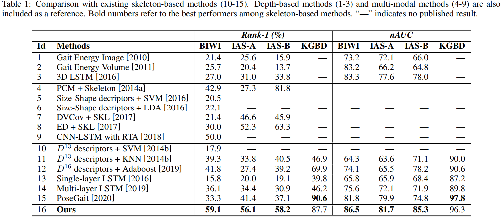

# Self-Supervised Gait Encoding with Locality-Aware Attention for Person Re-Identification
By Haocong Rao, Siqi Wang, Xiping Hu, Mingkui Tan, Huang Da, Jun Cheng, Bin Hu. In [IJCAI 2020](https://www.ijcai.org/Proceedings/2020/125). The extended journal version is available in [T-PAMI 2021](https://ieeexplore.ieee.org/abstract/document/9466418) with open [codes](https://github.com/Kali-Hac/Locality-Awareness-SGE).

## Introduction
This is the official implementation of the self-supervised gait encoding model presented by "Self-Supervised Gait Encoding with Locality-Aware Attention for Person Re-Identification".
The codes are used to reproduce experimental results of the proposed Attention-basd Gait Encodings (AGEs) in the [**paper**](https://www.ijcai.org/proceedings/2020/0125.pdf).


Abstract: Gait-based person re-identification (Re-ID) is valuable for safety-critical applications, and using only *3D skeleton data* to extract discriminative gait features for person Re-ID is an emerging open topic. Existing methods either adopt hand-crafted features or learn gait features by traditional supervised learning paradigms. Unlike previous methods, we for the first time propose a generic gait encoding approach that can utilize *unlabeled* skeleton data to learn gait representations in a *self-supervised* manner. Specifically, we first propose to introduce self-supervision by learning to reconstruct input skeleton sequences in reverse order, which facilitates learning richer high-level semantics and better gait representations. Second, inspired by the fact that motion's continuity endows temporally adjacent skeletons with higher correlations (''*locality*''), we propose a locality-aware attention mechanism that encourages learning larger attention weights for temporally adjacent skeletons when reconstructing current skeleton, so as to learn locality when encoding gait. Finally, we propose *Attention-based Gait Encodings* (AGEs), which are built using context vectors learned by locality-aware attention, as final gait representations. AGEs are directly utilized to realize effective person Re-ID. Our approach typically improves existing skeleton-based methods by 10-20% *Rank-1* accuracy, and it achieves comparable or even superior performance to multi-modal methods with extra RGB or depth information.

## Requirements
- Python 3.5
- Tensorflow 1.10.0 (GPU)

## Datasets \& Models
We provide three already preprocessed datasets (BIWI, IAS, KGBD) on <br/>
[Google Cloud](https://drive.google.com/drive/folders/1apjNcFvlUk9kqnqB1khI3k1HX_cNH46p?usp=sharing) &nbsp; &nbsp; &nbsp;
[Baidu Cloud](https://pan.baidu.com/s/1oOvY2pHM7DFQWcwfVwu6Lw) &nbsp; &nbsp; &nbsp; Password: &nbsp; &nbsp; kle5 &nbsp; &nbsp; &nbsp;
[Tencent Cloud](https://share.weiyun.com/5faKfq4) &nbsp; &nbsp; &nbsp; password：&nbsp; &nbsp; ma385h <br/>
<br />
The pre-trained models (BIWI, IAS, KGBD) are saved in this repository, and all three models can be acquired on <br />
[Google Cloud](https://drive.google.com/drive/folders/1I7eSd37ArGJt46ZfUSzXT0ciDvgW9m-K?usp=sharing) &nbsp; &nbsp; &nbsp;
[Baidu Cloud](https://pan.baidu.com/s/1367Gy-Bk9ojOrXveqCcm0Q) &nbsp; &nbsp; &nbsp; Password: &nbsp; &nbsp; r1jp &nbsp; &nbsp; &nbsp;
[Tencent Cloud](https://share.weiyun.com/5EBPkPZ) &nbsp; &nbsp; &nbsp; password：&nbsp; &nbsp; 6xpj8r  <br/> 
Please download the preprocessed datasets ``Datasets/`` and the model files ``Models/`` into the current directory. 
<br/>

The original datasets can be downloaded from:  &nbsp; &nbsp; &nbsp; [BIWI and IAS-Lab](http://robotics.dei.unipd.it/reid/index.php/downloads) &nbsp; &nbsp; &nbsp;
[KGBD](https://www.researchgate.net/publication/275023745_Kinect_Gait_Biometry_Dataset_-_data_from_164_individuals_walking_in_front_of_a_X-Box_360_Kinect_Sensor) 
 
## Usage

To (1) train the self-supervised gait encoding model to obtain AGEs and (2) validate the effectiveness of AGEs for person Re-ID on a specific dataset with a recognition network,  simply run the following command: 

```bash
# --attention: LA (default), BA  --dataset: BIWI, IAS, KGBD  --gpu 0 (default)
python train.py --dataset BIWI
```
Please see ```train.py``` for more details.

To print evaluation results (Rank-1 accuracy/nAUC) of person re-identification (Re-ID) on the testing set, run:

```bash
# --attention: LA (default), BA  --dataset: BIWI, IAS, KGBD  --gpu 0 (default)
python evaluate.py --dataset BIWI
```

Please see ```evaluate.py``` for more details.

## Results
| Models                       | **Rank-1** |       |       |      | **nAUC** |       |       |      |
|------------------------------|:------:|:-----:|:-----:|:----:|:----:|-------|-------|------|
|                              | **BIWI**   | **IAS-A** | **IAS-B** | **KGBD** | **BIWI** | **IAS-A** | **IAS-B** | **KGBD** |
| Gait Energy Image            | 21.4   | 25.6  | 15.9  |  —   | 73.2 | 72.1  | 66.0  |  —   |
| Gait Energy Volume           | 25.7   | 20.4  | 13.7  |  —   | 83.2 | 66.2  | 64.8  |  —   |
| 3D LSTM                      | 27.0   | 31.0  | 33.8  |  —   | 83.3 | 77.6  | 78.0  |  —   |
| Size-Shape Descriptors + SVM | 20.5   |  —    |  —    |  —   |  —   |  —    |  —    |  —   |
| Size-Shape Descriptors + LDA | 22.1   |  —    |  —    |  —   |  —   |  —    |  —    |  —   |
| DVCov + SKL                  | 21.4   | 46.6  | 45.9  |  —   |  —   |  —    |  —    |  —   |
| CNN-LSTM with RTA            | 50.0   |  —    |  —    |  —   |  —   |  —    |  —    |  —   |
| D-13 Descriptors + SVM       | 17.9   |  —    |  —    |  —   |  —   |  —    |  —    |  —   |
| D-13 Descriptors + KNN       | 39.3   | 33.8  | 40.5  | 46.9 | 64.3 | 63.6  | 71.1  | 90.0 |
| D-16 Descriptors + Adaboost  | 41.8   | 27.4  | 39.2  | 69.9 | 74.1 | 65.5  | 78.2  | 90.6 |
| Single-layer LSTM            | 15.8   | 20.0  | 19.1  | 39.8 | 65.8 | 65.9  | 68.4  | 87.2 |
| Multi-layer LSTM             | 36.1   | 34.4  | 30.9  | 46.2 | 75.6 | 72.1  | 71.9  | 89.8 |
| **PoseGait**                     | 33.3   | 41.4  | 37.1  | **90.6** | 81.8 | 79.9  | 74.8  | **97.8** |
| **AGE (Ours)**                   | **59.1** [(model)](https://drive.google.com/drive/folders/1XC0a3hqKx2XxFRCjYlG5eSSxlf4URkrl?usp=sharing)   | **56.1** [(model)](https://drive.google.com/drive/folders/1GfUrssk4B9kexSb6nuQwqxLKMm6SIsNc?usp=sharing)  | **58.2** [(model)](https://drive.google.com/drive/folders/1GfUrssk4B9kexSb6nuQwqxLKMm6SIsNc?usp=sharing)  | 87.7 [(model)](https://drive.google.com/drive/folders/1csYPna0GN_1n9_f-2ih6Q3Zyj8KgsKgT?usp=sharing) | **86.5** | **81.7** | **85.3**  | 96.3 |
<!--  -->

## Model Size & Computational Complexity
| Methods  | # Params | GFLOPs |
|----------|----------|--------|
| PoseGait |   26.80M |  364.8 |
| [AGEs (Ours)](https://github.com/Kali-Hac/SGE-LA)      |    7.15M |   37.4 |
| [CAGEs (Extension)](https://github.com/Kali-Hac/Locality-Awareness-SGE)     |    8.47M |    7.5 |


## Citation
If you find this code useful for your research, please cite our paper
```bash
@inproceedings{DBLP:conf/ijcai/RaoW0TD0020,
  author    = {Haocong Rao and
               Siqi Wang and
               Xiping Hu and
               Mingkui Tan and
               Huang Da and
               Jun Cheng and
               Bin Hu},
  title     = {Self-Supervised Gait Encoding with Locality-Aware Attention for Person
               Re-Identification},
  booktitle = {IJCAI},
  pages     = {898--905},
  publisher = {ijcai.org},
  year      = {2020}
}

@article{rao2021self,
  title={A self-supervised gait encoding approach with locality-awareness for 3D skeleton based person re-identification},
  author={Rao, Haocong and Wang, Siqi and Hu, Xiping and Tan, Mingkui and Guo, Yi and Cheng, Jun and Liu, Xinwang and Hu, Bin},
  journal={IEEE Transactions on Pattern Analysis and Machine Intelligence},
  year={2021},
  publisher={IEEE}
}

```
More awesome skeleton-based models are collected in our [Awesome-Skeleton-Based-Models](https://github.com/Kali-Hac/Awesome-Skeleton-Based-Models).

## License

SGE-LA is released under the MIT License.

